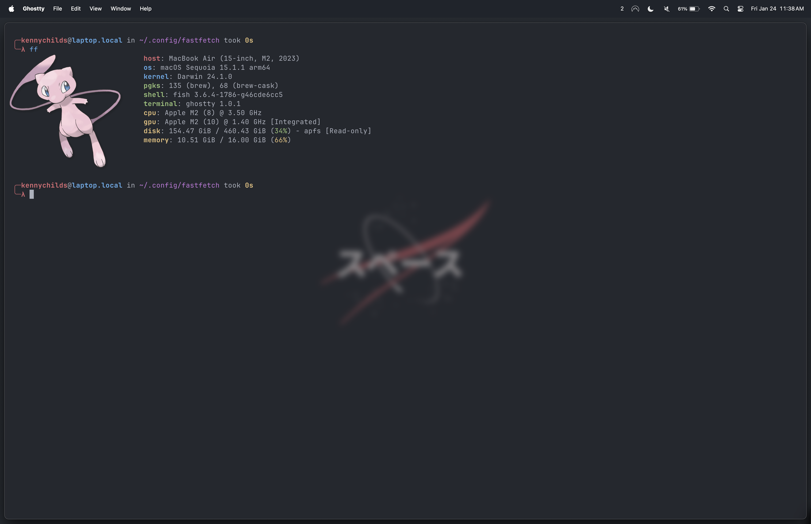

# dotfiles

My macOS dotfiles. Install script + gnu stow tracking coming soon.

## Examples

fastfetch:

Ghostty Terminal + Fish shell, [deta.surf](https://deta.surf) Browser, Cursor:

This setup is only possible thanks to aerospacewm! 
