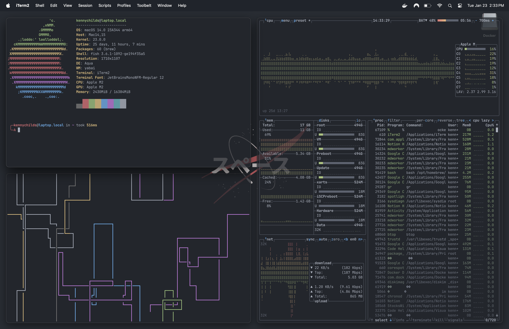
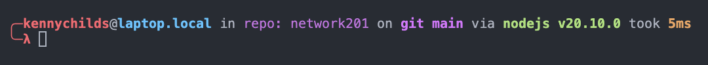

# Kenneth's MacOS Dotfiles

## Overview

There are the main components of my rice

- [fish](https://fishshell.com) is a good out of the box shell experience with a lot of customizability, similarly to zsh
- [starship.rs](https://starship.rs) is a terminal prompt built in rust and has many easy to customize modules
- [yabai](https://github.com/koekeishiya/yabai) is a tiling window manager for MacOS that replicates the i3 experience. Use with [skhd](https://github.com/koekeishiya/skhd) to add hotkeys
- I use [one dark pro](https://binaryify.github.io/OneDark-Pro/#/?id=about) for my colorscheme across applications

## Screenshots

## Install Script

- WIP